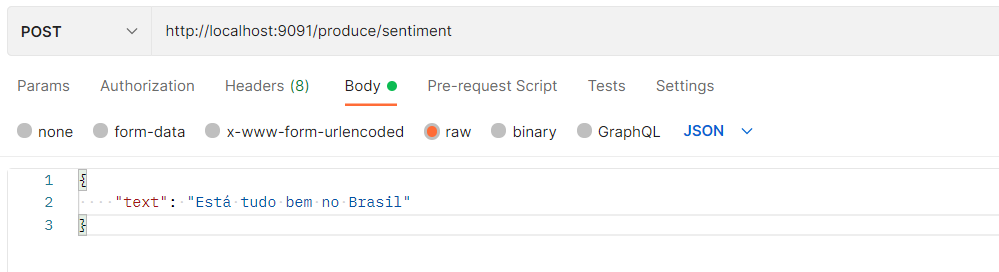
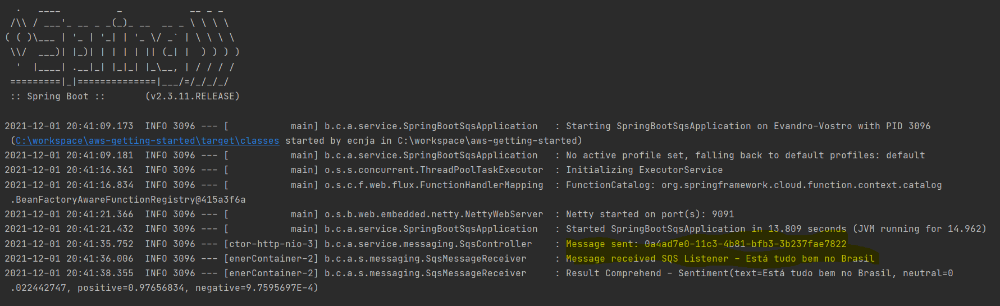

# Exploring AWS Services with Java by Examples

This project has been created with the aim of using AWS services with Spring Boot.
Onto this project, you can find some examples regarding these services:
## 1) AWS Simple Queue Service (SQS)
Message queue processing service for you serverless applications. 
On the other hand, in case of need a pub-sub service, it's recommended to use another AWS Service called SNS (Simple Notification Service).

Please, refer: https://aws.amazon.com/pt/blogs/compute/choosing-between-messaging-services-for-serverless-applications/

## 2) AWS Comprehend
This service is intended for Natural-Language Processing (NLP). It's possible to fetch entities, key phrases as well as sentiments.
Specifically for sentiment analysis, it's possible to segregate any expression as neutral, positive or negative.

## PreReqs
1) Have an AWS account. Right after that, provide your credentials into your OS environment variables.
2) Create an SQS queue and fill out cloud.aws.end-point.uri property

## How it works
After initializing Spring Boot App, use an API testing solution of your preference.  
In my case, I'd rather use Postman. 

This URL http://localhost:9091/produce/sentiment must be submitted as below:

## To be continued
I'm currently working for this project, therefore, from time to time, I'll provide more examples from AWS Services which might be useful. Additionally, I'll explore more Spring resources such as Spring REST Docs and Spring Cloud Functions (to apply for AWS Lambda).    